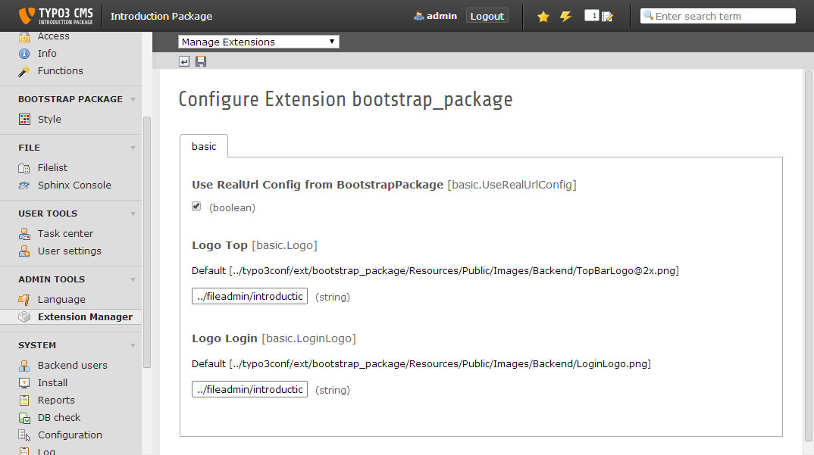

.. ==================================================
.. FOR YOUR INFORMATION
.. --------------------------------------------------
.. -*- coding: utf-8 -*- with BOM.

.. include:: ../../Includes.txt

=======================
Extension Configuration
=======================

Use the extension manager to adjust the Bootstrap Package to your needs.

[DEPRECATED] Backend Skin
=========================

For newer versions of TYPO3 > 6.2.x the backend skin is disabled.
For TYPO3 versions < 7.0 the backend can be disabled.
The Skin only does minimal adjustments so we will remove it in a future version.

Backend Logo & Login Logo
=========================

You can replace the default TYPO3 logos in the backend with the logo of your company or your customer.
The path to the logofile has to be relative to the TYPO3 backend.

**Example:**

.. code-block:: text

    basic.Logo = ../fileadmin/introduction/images/theme/backend/TopBarLogo@2x.png
    basic.LoginLogo = ../fileadmin/introduction/images/theme/backend/LoginLogo.png

**Defaults:**

.. code-block:: text

    basic.Logo = ../typo3conf/ext/bootstrap_package/Resources/Public/Images/Backend/TopBarLogo@2x.png
    basic.LoginLogo = ../typo3conf/ext/bootstrap_package/Resources/Public/Images/Backend/LoginLogo.png

PageTsConfig
============

The Bootstrap Package has a lot of PageTsConfig defaults.
In some cases it can be usefull to deactivate some of them if you do not need them.