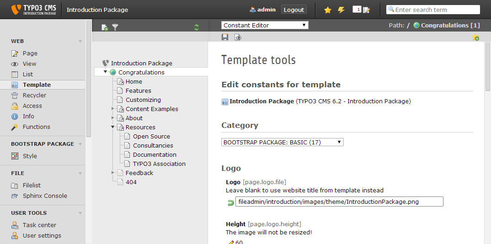

.. ==================================================
.. FOR YOUR INFORMATION
.. --------------------------------------------------
.. -*- coding: utf-8 -*- with BOM.

.. include:: ../../Includes.txt

==============================
TypoScript
==============================
Bootstrap Package was built to be so adjustable as pissible, so nothing is fix and everything can be overritten with TypoScript constants.
The constants are grouped in basic and advanced settings. Use the **TYPO3 Constant Editor** in the backend to modify the values.

Bootstrap Package: Basic Constants
==============================
The basic settings will provide easy to use and understandable options for that are used mainly for styling and appereance.

page.logo
------------------------------

+-----------------------------------+---------------+-----------------------------------------------------------------------+
| Property                          | Data Type     | Default                                                               |
+===================================+===============+=======================================================================+
| file                              | string        | EXT:bootstrap_package/Resources/Public/Images/BootstrapPackage.png    |
+-----------------------------------+---------------+-----------------------------------------------------------------------+
| height                            | integer       | 60                                                                    |
+-----------------------------------+---------------+-----------------------------------------------------------------------+
| width                             | integer       | 210                                                                   |
+-----------------------------------+---------------+-----------------------------------------------------------------------+

**Example:**

.. code-block:: typoscript

    page {
        logo {
            file = fileadmin/Theme/Logo.png
            height = 50
            width = 150
        }
    }

page.meta
------------------------------

+-----------------------------------+---------------+-----------------------------------------------------------------------+
| Property                          | Data Type     | Default                                                               |
+===================================+===============+=======================================================================+
| description                       | string        |                                                                       |
+-----------------------------------+---------------+-----------------------------------------------------------------------+
| author                            | string        |                                                                       |
+-----------------------------------+---------------+-----------------------------------------------------------------------+
| keywords                          | string        |                                                                       |
+-----------------------------------+---------------+-----------------------------------------------------------------------+

page.theme
------------------------------

+-----------------------------------+---------------+-----------------------------------------------------------------------+
| Property                          | Data Type     | Default                                                               |
+===================================+===============+=======================================================================+
| navigationstyle                   | options       | default                                                               |
+-----------------------------------+---------------+-----------------------------------------------------------------------+
| breadcrumb                        | boolean       | 1                                                                     |
+-----------------------------------+---------------+-----------------------------------------------------------------------+

page.theme.copyright
------------------------------

+-----------------------------------+---------------+-----------------------------------------------------------------------+
| Property                          | Data Type     | Default                                                               |
+===================================+===============+=======================================================================+
| enable                            | boolean       | 1                                                                     |
+-----------------------------------+---------------+-----------------------------------------------------------------------+
| text                              | string        | Built on a Windows 8.1 Surface Pro. Running with TYPO3.               |
|                                   |               | Made with <3 by Benjamin Kott                                         |
+-----------------------------------+---------------+-----------------------------------------------------------------------+

page.theme.news
------------------------------

+-----------------------------------+---------------+-----------------------------------------------------------------------+
| Property                          | Data Type     | Default                                                               |
+===================================+===============+=======================================================================+
| list.header_position              | options       | left                                                                  |
+-----------------------------------+---------------+-----------------------------------------------------------------------+
| list.header_layout                | options       | 2                                                                     |
+-----------------------------------+---------------+-----------------------------------------------------------------------+
| list.imageorient                  | options       | 25                                                                    |
+-----------------------------------+---------------+-----------------------------------------------------------------------+
| list.imagecols                    | options       | 1                                                                     |
+-----------------------------------+---------------+-----------------------------------------------------------------------+
| list.maxW                         | integer       | 1140                                                                  |
+-----------------------------------+---------------+-----------------------------------------------------------------------+
| list.maxWInText                   | integer+      |                                                                       |
+-----------------------------------+---------------+-----------------------------------------------------------------------+
| pagination.itemsperpage           | integer       | 5                                                                     |
+-----------------------------------+---------------+-----------------------------------------------------------------------+

Bootstrap Package: Advanced Constants
==============================
The advanced settings sould be used only if you really know what you are doing.

page.fluidtemplate
------------------------------

+-----------------------------------+---------------+-----------------------------------------------------------------------+
| Property                          | Data Type     | Default                                                               |
+===================================+===============+=======================================================================+
| layoutRootPath                    | string        | EXT:bootstrap_package/Resources/Private/Layouts/Page/                 |
+-----------------------------------+---------------+-----------------------------------------------------------------------+
| partialRootPath                   | string        | EXT:bootstrap_package/Resources/Private/Partials/Page/                |
+-----------------------------------+---------------+-----------------------------------------------------------------------+
| templateRootPath                  | string        | EXT:bootstrap_package/Resources/Private/Templates/Page/               |
+-----------------------------------+---------------+-----------------------------------------------------------------------+

page.includePath
------------------------------

+-----------------------------------+---------------+-----------------------------------------------------------------------+
| Property                          | Data Type     | Default                                                               |
+===================================+===============+=======================================================================+
| css                               | string        | EXT:bootstrap_package/Resources/Public/Css/                           |
+-----------------------------------+---------------+-----------------------------------------------------------------------+
| icons                             | string        | EXT:bootstrap_package/Resources/Public/Icons/                         |
+-----------------------------------+---------------+-----------------------------------------------------------------------+
| javascript                        | string        | EXT:bootstrap_package/Resources/Public/JavaScript/                    |
+-----------------------------------+---------------+-----------------------------------------------------------------------+

page.meta
------------------------------

+-----------------------------------+---------------+-----------------------------------------------------------------------+
| Property                          | Data Type     | Default                                                               |
+===================================+===============+=======================================================================+
| viewport                          | string        | width=device-width, initial-scale=1                                   |
+-----------------------------------+---------------+-----------------------------------------------------------------------+
| robots                            | string        | index,follow                                                          |
+-----------------------------------+---------------+-----------------------------------------------------------------------+
| apple-mobile-web-app-capable      | string        | no                                                                    |
+-----------------------------------+---------------+-----------------------------------------------------------------------+
| compatible                        | string        | IE=edge,chrome=1                                                      |
+-----------------------------------+---------------+-----------------------------------------------------------------------+
| google                            | string        | notranslate                                                           |
+-----------------------------------+---------------+-----------------------------------------------------------------------+

plugin.bootstrap_package_contentelements.view
------------------------------

+-----------------------------------+---------------+-----------------------------------------------------------------------+
| Property                          | Data Type     | Default                                                               |
+===================================+===============+=======================================================================+
| layoutRootPath                    | string        | EXT:bootstrap_package/Resources/Private/Layouts/ContentElements/      |
+-----------------------------------+---------------+-----------------------------------------------------------------------+
| partialRootPath                   | string        | EXT:bootstrap_package/Resources/Private/Partials/ContentElements/     |
+-----------------------------------+---------------+-----------------------------------------------------------------------+
| templateRootPath                  | string        | EXT:bootstrap_package/Resources/Private/Templates/ContentElements/    |
+-----------------------------------+---------------+-----------------------------------------------------------------------+

config
------------------------------

+-----------------------------------+---------------+-----------------------------------------------------------------------+
| Property                          | Data Type     | Default                                                               |
+===================================+===============+=======================================================================+
| baseURL                           | string        | width=device-width, initial-scale=1                                   |
+-----------------------------------+---------------+-----------------------------------------------------------------------+
| no_cache                          | boolean       | 0                                                                     |
+-----------------------------------+---------------+-----------------------------------------------------------------------+
| compressJs                        | boolean       | 1                                                                     |
+-----------------------------------+---------------+-----------------------------------------------------------------------+
| compressCss                       | boolean       | 1                                                                     |
+-----------------------------------+---------------+-----------------------------------------------------------------------+
| concatenateJs                     | boolean       | 1                                                                     |
+-----------------------------------+---------------+-----------------------------------------------------------------------+
| concatenateCss                    | boolean       | 1                                                                     |
+-----------------------------------+---------------+-----------------------------------------------------------------------+
| headerComment                     | string        | Based on the TYPO3 Bootstrap Package                                  |
|                                   |               | by Benjamin Kott - http://www.bk2k.info                               |
+-----------------------------------+---------------+-----------------------------------------------------------------------+