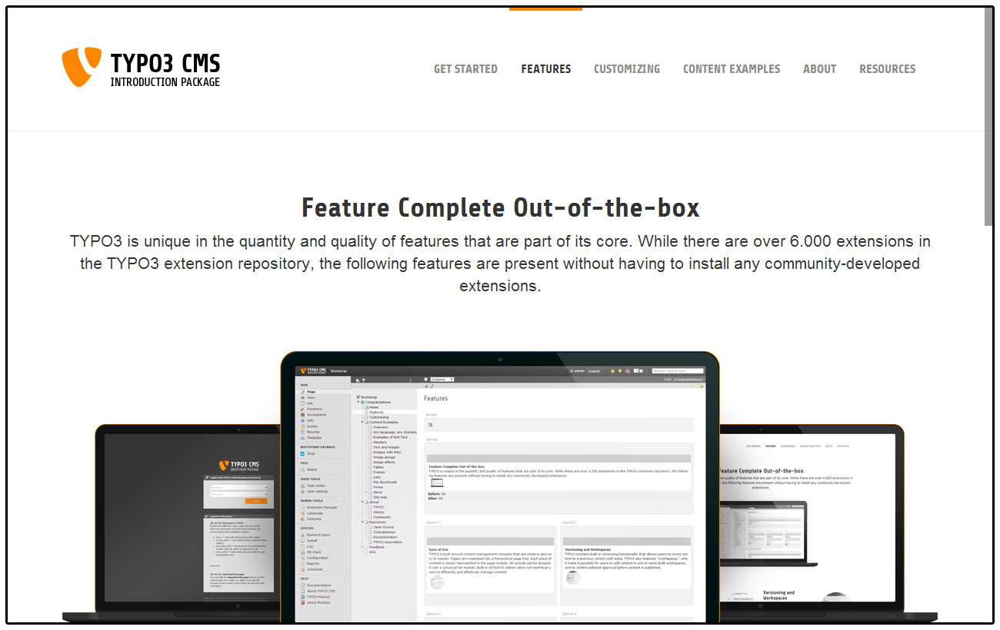
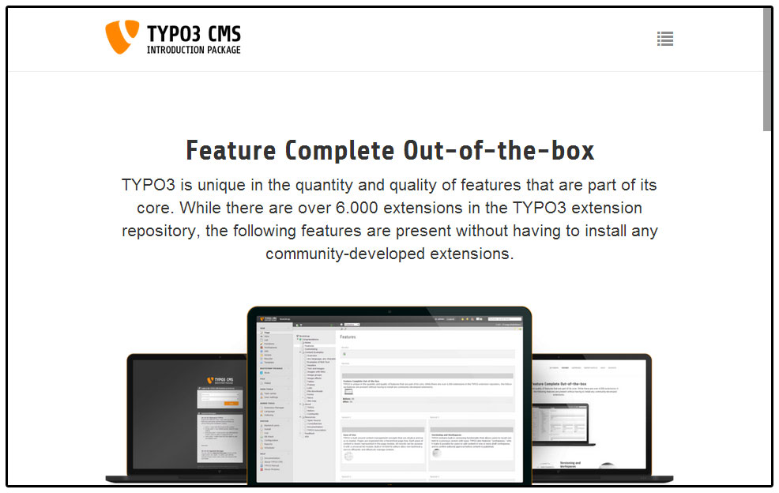
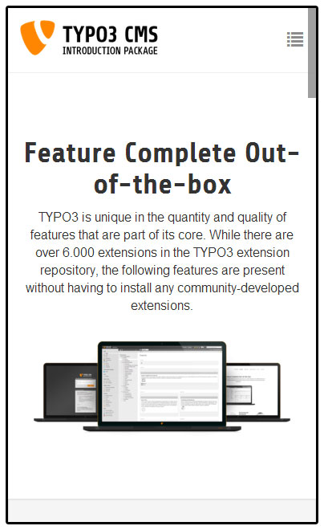

.. ==================================================
.. FOR YOUR INFORMATION
.. --------------------------------------------------
.. -*- coding: utf-8 -*- with BOM.

.. include:: ../Includes.txt

==============================
Introduction
==============================

Bootstrap Package is a theme for TYPO3 CMS based on the `Bootstrap CSS Framework <http://getbootstrap.com/>`_ Version 3.3.5

Features
==============================

* Full configured TypoScript Setup provided as Static Template
* Completely adjustable via TypoScript Constants
* Preconfigured RealURL for SEO-Friendly URLs

  * Apache Configuration included

* TYPO3 CMS rendering is adjusted to the needs of `Bootstrap CSS Framework <http://getbootstrap.com/>`_

  * Layouts for all Content Elements
  * Section Frames

* Bootstrap specific Content Elements

  * Accordion
  * External Media
  * Carousel
  * List Group
  * List Group
  * Tab
  * Text and Icon

* Individual Page Layouts
* Built-in Less Parser

  * All Variables are configurable via Constant Editor
  * Less support in page.includeCSS property

* Backend Layouts via PageTsConfig

Screenshots
==============================

