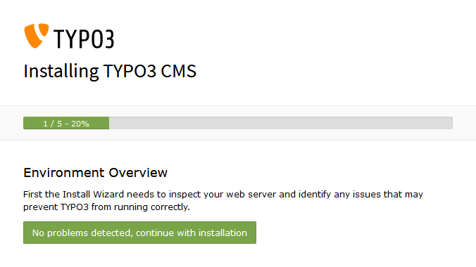
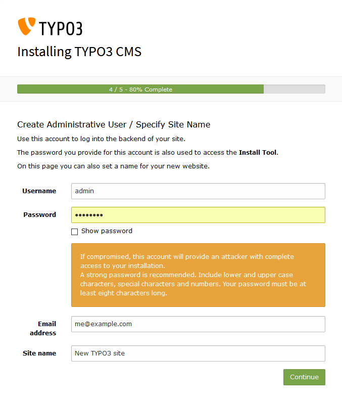
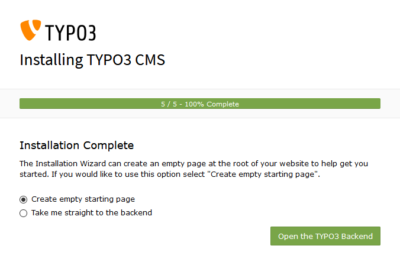

.. ==================================================
.. FOR YOUR INFORMATION
.. --------------------------------------------------
.. -*- coding: utf-8 -*- with BOM.

.. include:: ../../Includes.txt

===========
Setup TYPO3
===========

In this step your new TYPO3 instance will be setup with a initial
configuration. To gain access to the **TYPO3 Install Wizard** you need to
create the file :file:`FIRST_INSTALL` in the web server root directory:

.. code-block:: bash

   ddev exec touch public/FIRST_INSTALL
   ddev launch

With TYPO3 Secure Web use the following commands:

.. code-block:: bash

   ddev exec touch private/FIRST_INSTALL
   ddev launch

The last command will open the browser pointing to the **TYPO3 Install Wizard**
which is used for the initial setup of your project. Some steps are skipped
because various configurations like database credentials are already provided
by DDEV and you don't have to care about.

Step 1
======

Just click :button:`No problems detected, continue with installation` to
continue with the next step.

Step 2
======

Fill the form with the desired credentials for your administrative user and
click :button:`Continue` to head to the final step.

Step 3
======

Select :button:`Create empty starting page` and click
:button:`Open the TYPO3 Backend` to be redirected to the backend login page.
