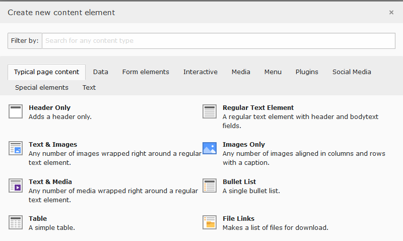

.. ==================================================
.. FOR YOUR INFORMATION
.. --------------------------------------------------
.. -*- coding: utf-8 -*- with BOM.

.. include:: ../../Includes.txt

====================
Provide some Content
====================

On the left side choose the **Page module** and in the **page tree** click the
page **Home**.

Add a new content element by clicking

On the **Content Element Wizard** you choose **Regular Text Element**.

Fill some content into the field **Header** and **Text**.

On the top click :button:`Save` and :button:`Preview`.

Now you see your first page with the created content before:

Now lets add some more pages and content to the new site:

* A new **Shortcut** with the name **Home**
* A new **Menu separator** with the name **Divider**
* Some new pages e.g. **Page 1** to **Page 3**

Afterwards click on every created icon and enable all of it.

Edit the shurtcut **Home** and change the **Shurtcut Mode** to
**Parent page of selected/current page**:

Save the changes and now you should end with the following page tree:

Click again to the :button:`Preview` button and see the new page with the
menu:

