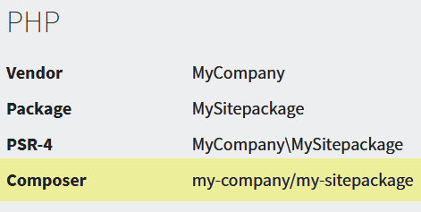
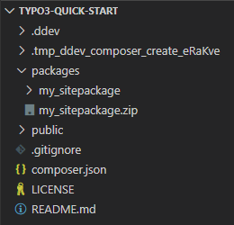

.. ==================================================
.. FOR YOUR INFORMATION
.. --------------------------------------------------
.. -*- coding: utf-8 -*- with BOM.

.. include:: ../../Includes.txt

====================
Create a Sitepackage
====================

In your project folder create a folder :file:`packages`. This folder will be
used as local path repository for project specific extensions and packages
like the **Sitepackage** we will create.

Go to the `Sitepackage Builder <https://www.sitepackagebuilder.com/new/>`_
and create your personal **Sitepackage**.

Make sure you select the correct **TYPO3 Version** and **Base Package**, you
can relay your **Sitepackage** on the TYPO3 extension **Bootstrap Package** or
on pure core functionality by selecting **Fluid Styled Content**.

Remeber the **Composer name** of your **Sitepackage** shown after the
creation, you will need it later again, this guide will use the
**Sitepackage name** :composer:`my-company/my-sitepackage`.

Save the generated **Sitepackage** to the :file:`packages` folder and extract
it into a sub folder, usualy the name of the downloaded ZIP file. Do not
extract the **Sitepackage** directly into the :file:`packages` folder. This
guide will use the folder name :file:`my_sitepackage`.

Composer needs to know about your local path repository and you have to add
the previously created **Sitepackage** to your project, remember to replace
the **vendor/package**:

.. code-block:: bash

   ddev composer config repositories.local path "'packages/*'"
   ddev composer require "my-company/my-sitepackage:@dev" --no-update

You will end with the following project folder structure, the folder
:file:`.tmp_ddev_composer_create_*` is probably missing:

