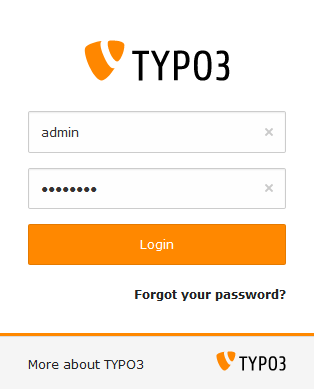
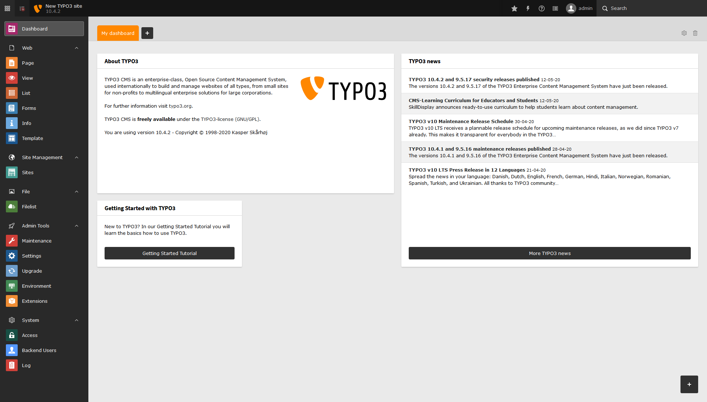
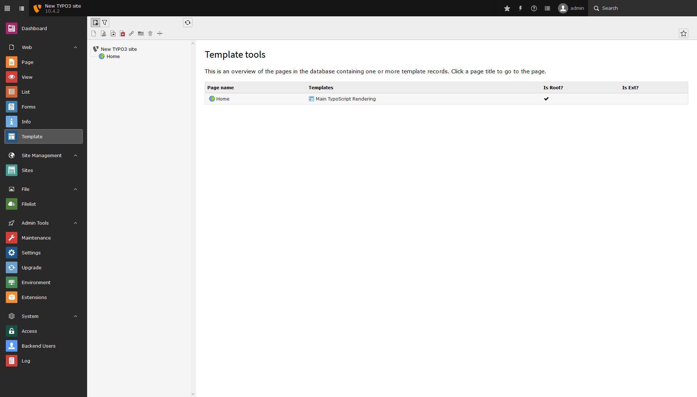
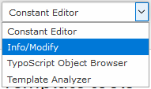
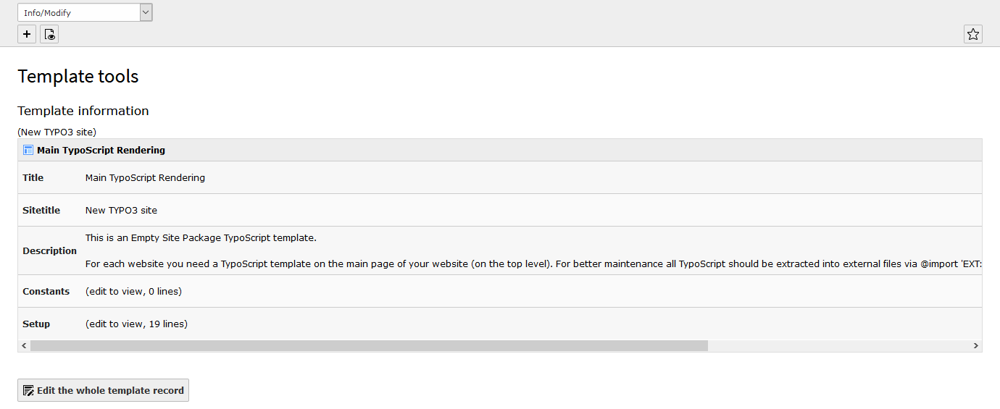
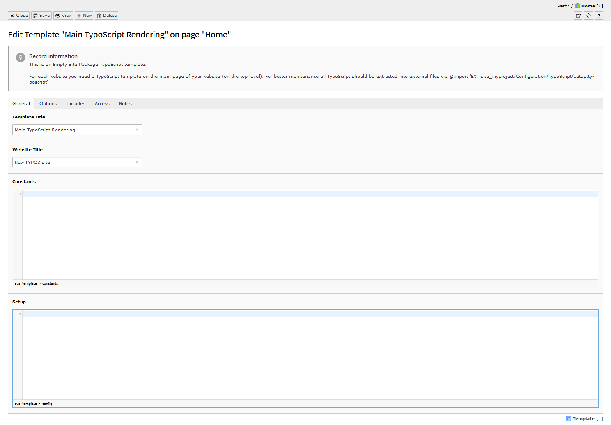
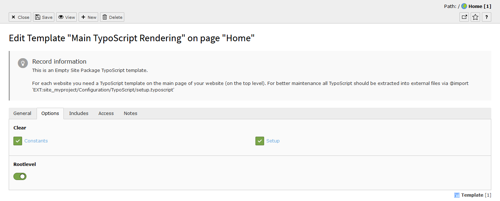
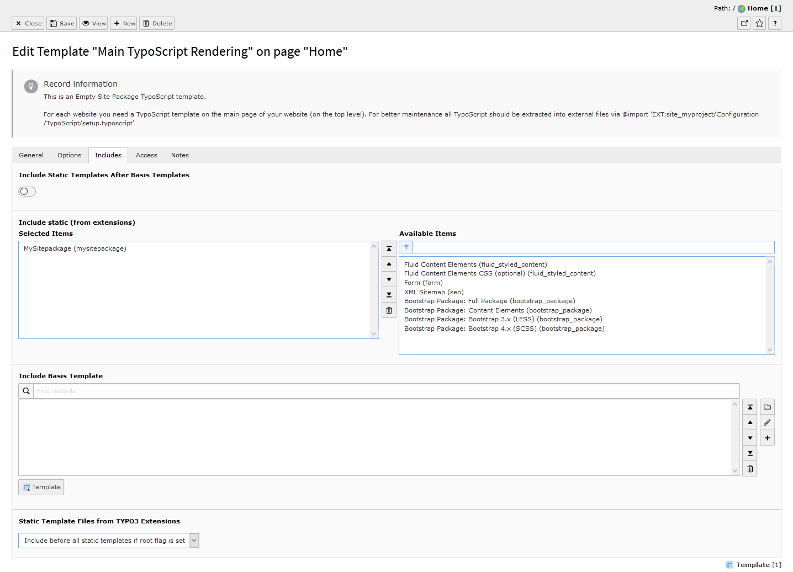
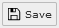

.. ==================================================
.. FOR YOUR INFORMATION
.. --------------------------------------------------
.. -*- coding: utf-8 -*- with BOM.

.. include:: ../../Includes.txt

=============================
Setup the TypoScript Template
=============================

Login to the Backend
====================

The **TYPO3 Install Wizard** should have redirected you to the backend login
screen. However you always can head to the backend with this command:

.. code-block:: bash

   ddev launch typo3

Enter your choosen credentials here and login to the
TYPO3 backend.

The Dashboard
-------------

After the successful login you will be redirected to the TYPO3 Dashboard.

Edit the TypoScript Template
============================

On the left side choose the **Template module**.

Here you select the existing template **Main TypoScript Rendering** on the
page **Home**.

On the top select :button:`Info/Modify`

and click to :button:`Edit the whole template record`.

General
-------

On the tab **General** remove the default content of the **Setup** field. You
are free to change here also the **Template Title**.

Options
-------

On the tab **Options** change the settings according to this listing and the
following image:

* Check **Clear Constants**
* Check **Clear Setup**
* Activate **Rootlevel**

Includes
--------

On the tab **Includes** change the settings according to this listing and the
following image:

* Remove all **Include static (from extensions)** items
* Add your **Sitepackage** to **Include static (from extensions)**
* For **Static Template Files from TYPO3 Extensions** select
  **Include before all static templates if root flag is set**

Save and Close the Template
---------------------------

On the top click to **Save**:

The template is now fully setup and you can close it.
